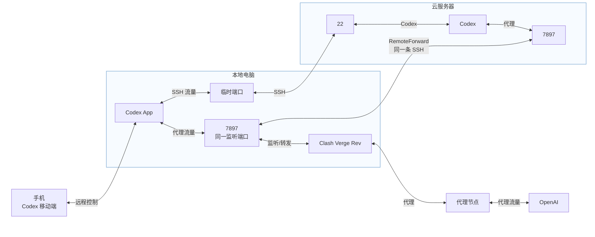

# Codex 三位一体使用架构说明

## 1. 整体结构

这套方案把三个使用入口连接在一起：

- **Codex 移动端**：方便在手机上发起任务、查看进度、回复消息和批准操作。
- **本地电脑 Codex App**：连接手机、云服务器和本机 Clash Verge Rev。
- **云服务器 Codex**：直接承担代码开发、运行、测试和部署。

云服务器是主要开发环境。项目文件、终端、依赖和运行环境都可以放在服务器上，不要求在本地电脑再维护一套相同的开发环境。

当前用 Markdown 内嵌 Mermaid 图表达架构，并配套生成 SVG、PNG 图片。组件可以根据图片可读性自由排列，验收以连接关系、端口和数据流向为准。

图中不使用 SSH 的 `1` / `2` 标签，也不在图下方放置长段说明；只保留 Codex 的 SSH 连接和 `7897` 的 `RemoteForward`。



## 2. 手机如何控制云服务器 Codex

手机不会直接登录云服务器，也不会直接持有服务器的 SSH 连接。Codex App 使用 `aliyun_wlcb_proxy`；PowerShell 和 VS Code 使用不带端口转发的 `aliyun_wlcb`。

完整控制链路是：

```text
Codex 移动端
→ 远程连接本地 Codex App
→ 本地 Codex App 管理 SSH 连接
→ SSH 在云服务器启动和管理 Codex App Server
→ 手机操作云服务器上的 Codex 会话
```

因此，手机可以查看服务器 Codex 的任务进度、发送后续消息和批准操作，但实际的文件访问、命令执行、测试和部署都发生在云服务器上。

## 3. 两类 SSH 连接与图示

本地电脑保留两套 SSH 配置。

### 普通 SSH

用于：

- PowerShell 登录服务器；
- VS Code Remote SSH；
- 其他普通终端或文件管理工具。

普通 SSH 只提供远程登录，不提供 Clash 反向代理；它使用本机随机临时端口连接云服务器 TCP `22`，不会占用云端 `7897`。主框图中单独标出了 PowerShell / VS Code 通过 `aliyun_wlcb` 到云服务器普通登录目标的连接。

### 提供反向代理的 SSH

主要供 Codex App 连接云服务器使用，同时建立 SSH 反向端口转发，让服务器 Codex 可以使用本机 Clash。

Codex 专用 SSH 同样连接云服务器 TCP `22`，但额外让云服务器监听 `127.0.0.1:7897`，并通过 `RemoteForward` 连接到本机 `127.0.0.1:7897`。本机 SSH 客户端使用的仍是随机临时端口。

核心配置是：

```sshconfig
RemoteForward 127.0.0.1:7897 127.0.0.1:7897
ExitOnForwardFailure yes
ServerAliveInterval 30
ServerAliveCountMax 3
```

SSH 连接本身是一条双向的加密 TCP 通道：本地 SSH 客户端和云服务器 SSH 服务端都可以在这条连接上传输数据。Mermaid 图中用 `<-->` 表示这一条连接的双向性质，不表示两条独立 SSH 连接。

`RemoteForward` 只是利用这条双向 SSH 连接建立端口转发：云服务器上的程序访问云端 `127.0.0.1:7897` 时，数据通过同一条 SSH 加密连接到达本机 `127.0.0.1:7897`，再交给 Clash Verge Rev 转发；代理请求和响应都沿这条连接传输。

两类 SSH 可以同时存在，但同一时间只应保留一条占用服务器 `127.0.0.1:7897` 的反向转发连接。

## 4. Codex 的代理流量

服务器 Codex 将服务器自身的 `127.0.0.1:7897` 设置为代理地址。

完整网络路径是：

```text
云服务器 Codex
→ 服务器 127.0.0.1:7897
→ 提供反向代理的 SSH 连接
→ 本地电脑 127.0.0.1:7897
→ 本地 Clash Verge Rev 监听并转发该端口流量
→ Clash 代理节点
→ OpenAI 目标服务器
```

本机 `7897` 是同一个监听端口，但进入它的是两条不同的 TCP 连接：

- 本机 Codex App 的 SSH 流量：`Codex App → 本机 7897 → Clash Verge Rev`；
- 云服务器 Codex 的代理流量：`云端 7897 → RemoteForward → 本机 7897 → Clash Verge Rev`。

两端都使用 `7897`，但不会产生端口冲突，因为：

- 第一个 `7897` 位于云服务器；
- 第二个 `7897` 位于本地电脑；
- 两个端口通过 SSH 反向转发连接。

更准确地说，Codex 不是“从 `7897` 端口发出流量”，而是连接服务器上的代理地址 `127.0.0.1:7897`。

图中 `Clash Verge Rev` 不是额外的远程节点；它只表示本机监听并转发 `127.0.0.1:7897` 流量的程序。代理节点和 OpenAI 是代理链路的终端组件，图片位置不代表网络层级。

## 5. 服务器 Codex 的代理设置

服务器 Codex 使用的代理地址应为：

```dotenv
HTTP_PROXY=http://127.0.0.1:7897
HTTPS_PROXY=http://127.0.0.1:7897
ALL_PROXY=http://127.0.0.1:7897
NO_PROXY=127.0.0.1,localhost
```

如果配置保存在 Codex 专用的 `~/.codex/.env` 中，只会由 Codex 及其子进程使用，不会自动改变云服务器的全部网络流量。

## 6. 连接关系与生命周期

整套方案依赖以下组件保持可用：

- 本地电脑开机、联网并保持唤醒；
- 本地 Codex App 保持运行；
- 提供反向代理的 SSH 保持连接；
- 本机 Clash Verge Rev 保持运行；
- 云服务器保持开机和联网。

各组件停止后的影响：

| 组件 | 停止后的影响 |
|---|---|
| 手机退出或断网 | 暂时不能远程操作，已经运行的任务不一定停止 |
| 本地 Codex App 关闭 | 手机远程连接停止，App 管理的 SSH 环境通常也会断开 |
| 反向代理 SSH 断开 | 服务器代理入口 `127.0.0.1:7897` 失效 |
| Clash Verge Rev 关闭 | SSH 可能仍连接，但服务器 Codex 无法通过该代理联网 |
| 本地电脑睡眠或断网 | 手机远程控制、SSH 和代理链路均会中断 |
| 云服务器关闭 | 服务器上的开发、测试和部署环境不可用 |

## 7. 最终定位

这套架构不是简单的“移动控制、本地开发、云端部署”，而是：

- 手机提供便捷的远程访问入口；
- 本地电脑负责承载 Codex App、SSH 和 Clash 连接；
- 云服务器直接承担完整的开发、测试和部署工作。

## 8. 当前文档实现

- 主实现：本文件中的 `mermaid` 结构图。
- 用户要求查看或输出结构图时，直接输出本文件中的 Mermaid 图代码供预览。
- 当前以 Mermaid 图为实现目标；除非用户明确要求，不生成或更新 SVG、PNG。

如果服务器同时承担正式生产服务，建议进一步使用容器、独立用户或独立目录隔离开发、测试和生产环境，避免开发操作影响线上服务。
