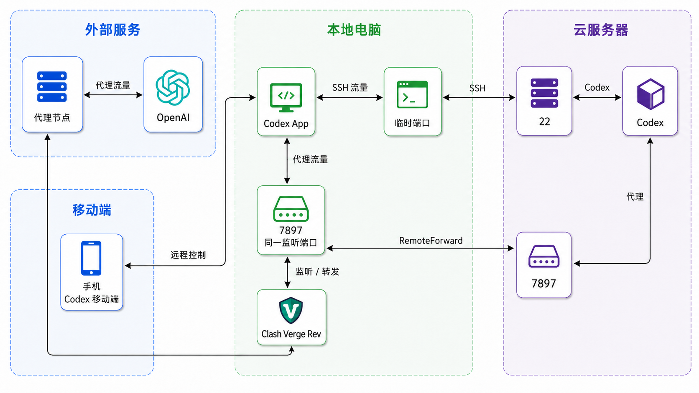
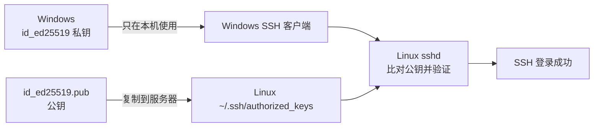

# 手机、Windows 与 Linux 云服务器协同使用 Codex

这篇文章解决一个实际问题：

> **手机发出任务，Windows 负责连接，Linux 云服务器负责运行 Codex；当云服务器无法直接访问 OpenAI 时，再借用 Windows 上的 Clash 代理。**

可以把三台设备理解成三个角色：

| 设备 | 做什么 |
|---|---|
| 手机 | 发任务、看进度、回复和批准操作 |
| Windows 电脑 | 运行 Codex App，保持连接，并运行 Clash Verge Rev |
| Linux 云服务器 | 保存项目，运行 Codex、测试和部署 |

## 先看整体连接

正常使用时，手机和云服务器并不是直接连接。手机先连接 Windows 上的 Codex App，再由 Codex App 连接云服务器。

在本文场景中，国内云服务器无法直接访问 OpenAI，所以云端 Codex 的网络请求还要经过 Windows：

```text
手机
  ↓ 操作
Windows Codex App
  ↓ SSH 连接
Linux 云服务器 Codex
  ↓ 代理请求
Windows Clash Verge Rev
  ↓
网络代理节点 → OpenAI
```



*图：手机控制 Windows Codex App；云服务器 Codex 的代理流量通过 SSH 回到 Windows，再由 Clash 访问 OpenAI。*

## 为什么需要两种 SSH 连接

这里的 SSH 可以先理解成“Windows 通往云服务器的一扇加密的门”。

- **普通 SSH**：打开这扇门并登录服务器，适合 PowerShell、VS Code；
- **带 `RemoteForward` 的 SSH**：除了登录，还在门里增加一条“回程通道”，把云服务器的代理请求带回 Windows。

`RemoteForward` 是 SSH 的反向端口转发功能。它让云服务器上的 Codex 访问云端 `127.0.0.1:7897` 时，沿 SSH 连接回到 Windows 的 `127.0.0.1:7897`，再交给 Clash：

```text
云服务器 Codex
    ↓ HTTP_PROXY / HTTPS_PROXY
云端 127.0.0.1:7897
    ↓ SSH RemoteForward
Windows 127.0.0.1:7897
    ↓
Clash Verge Rev → 网络代理节点 → OpenAI
```

因此，**带 `RemoteForward` 的 SSH = 普通 SSH 登录 + 一条反向转发通道**。它不是新的代理软件，也不是 VPN；只有明确使用云端 `127.0.0.1:7897` 的 Codex 及其子进程会走这条路径。

本文统一使用代理端口 **7897**。云端和 Windows 各有一个 `7897`，属于不同主机，不会冲突；但同一时间只能有一条连接占用云端 `7897`。

## 一、准备 SSH 私钥和公钥

SSH 密钥是一对文件：

- `id_ed25519`：私钥，只留在 Windows 本机；
- `id_ed25519.pub`：公钥，复制到 Linux 的 `~/.ssh/authorized_keys`。

服务器只保存公钥，不需要、也不应该保存私钥。



### 1. 生成或检查密钥

在 PowerShell 检查：

```powershell
Get-ChildItem "$env:USERPROFILE\.ssh\id_ed25519*"
```

如果没有 `id_ed25519` 和 `id_ed25519.pub`，生成它们：

```powershell
ssh-keygen -t ed25519 -C "codex-windows"
```

保存路径直接按回车使用默认值，并设置私钥口令。私钥口令不要写进配置文件或文章。

### 2. 安装公钥

先用密码、云厂商控制台或现有密钥登录服务器。在 Windows 复制公钥：

```powershell
Get-Content "$env:USERPROFILE\.ssh\id_ed25519.pub" | Set-Clipboard
```

在 Linux 执行：

```bash
mkdir -p ~/.ssh
chmod 700 ~/.ssh
nano ~/.ssh/authorized_keys
```

把公钥完整粘贴为一行，保存后执行：

```bash
chmod 600 ~/.ssh/authorized_keys
```

公钥必须放在实际登录用户自己的目录中。例如登录用户是 `dev`，应放在 `/home/dev/.ssh/authorized_keys`，不是 `/root/.ssh/authorized_keys`。

### 3. 验证密钥登录

```powershell
ssh -i "$env:USERPROFILE\.ssh\id_ed25519" -o IdentitiesOnly=yes <你的Linux用户名>@<你的服务器IP>
```

只要求输入私钥口令，通常就表示公钥认证成功。若仍要求 Linux 密码，检查公钥是否完整、用户是否正确，以及权限是否为 `700` / `600`。

## 二、配置 Windows SSH

编辑：

```text
C:\Users\<你的Windows用户名>\.ssh\config
```

写入以下内容，并替换服务器 IP、Linux 用户名和 Windows 用户名：

```sshconfig
# 普通登录：PowerShell、VS Code 使用
Host aliyun_wlcb
    HostName <你的服务器IP>
    User <你的Linux用户名>
    Port 22
    IdentityFile C:/Users/<你的Windows用户名>/.ssh/id_ed25519
    IdentitiesOnly yes

# Codex App 使用：登录 + RemoteForward
Host aliyun_wlcb_proxy
    HostName <你的服务器IP>
    User <你的Linux用户名>
    Port 22
    IdentityFile C:/Users/<你的Windows用户名>/.ssh/id_ed25519
    IdentitiesOnly yes
    RemoteForward 127.0.0.1:7897 127.0.0.1:7897
    ExitOnForwardFailure yes
    ServerAliveInterval 30
    ServerAliveCountMax 3
```

关键配置是：

```sshconfig
RemoteForward <云端监听地址>:<云端端口> <Windows目标地址>:<Windows端口>
```

本方案中，云端和 Windows 都使用 `127.0.0.1:7897`。它们属于不同主机，所以不冲突；但同一时间只能有一条连接占用云端 `7897`。

两个别名的区别：

| 命令 | 用途 |
|---|---|
| `ssh aliyun_wlcb` | 普通登录，不建立反向转发 |
| `ssh aliyun_wlcb_proxy` | 登录并建立云端 `7897` 到 Windows `7897` 的反向转发 |

私钥始终留在 Windows；不要上传到手机、服务器或文章中。公钥泄露通常不等于私钥泄露，但私钥泄露后应立即删除服务器上的对应公钥并重新生成密钥。

## 三、验证代理链路

### 1. 验证 Windows Clash

启动 Clash Verge Rev，在 PowerShell 执行：

```powershell
curl.exe -x http://127.0.0.1:7897 https://api.ipify.org
```

能返回公网 IP，说明本机代理可用。

### 2. 建立带转发的 SSH

测试时执行：

```powershell
ssh aliyun_wlcb_proxy
```

保持该连接在线。实际使用 Codex App 时，由 App 管理这条连接，不要再手动启动第二条相同的转发。

### 3. 在 Linux 验证云端入口

另开一个 PowerShell，普通登录服务器：

```powershell
ssh aliyun_wlcb
```

在 Linux 执行：

```bash
ss -lnt | grep 7897
curl -x http://127.0.0.1:7897 https://api.ipify.org
```

能返回代理节点的公网 IP，说明 `RemoteForward` 成功。

## 四、配置并启动云端 Codex

在 Linux 创建 Codex 环境文件：

```bash
mkdir -p ~/.codex
nano ~/.codex/.env
```

写入：

```dotenv
HTTP_PROXY=http://127.0.0.1:7897
HTTPS_PROXY=http://127.0.0.1:7897
ALL_PROXY=http://127.0.0.1:7897
http_proxy=http://127.0.0.1:7897
https_proxy=http://127.0.0.1:7897
all_proxy=http://127.0.0.1:7897
NO_PROXY=127.0.0.1,localhost
no_proxy=127.0.0.1,localhost
```

保存并限制权限：

```bash
chmod 600 ~/.codex/.env
```

然后使用设备码登录：

```bash
codex login --device-auth
codex login status
```

登录成功后，在项目目录启动：

```bash
cd /path/to/your/project
codex
```

## 五、手机端使用

每次使用前：

1. Windows 保持开机、联网且不睡眠；
2. 启动 Clash Verge Rev；
3. 启动 Windows Codex App，让它使用 `aliyun_wlcb_proxy`；
4. 确认 Linux 上的 Codex 已启动；
5. 手机连接 Codex App，发送任务并查看进度。

手机不保存服务器私钥，也不直接建立 SSH。代码读写、命令执行、测试和部署都发生在 Linux 云服务器上。

## 常见问题

### `remote port forwarding failed for listen port 7897`

云端 `7897` 已被另一条反向转发占用。关闭重复的 `aliyun_wlcb_proxy`，其他终端使用 `aliyun_wlcb`。

### 云端没有监听 `7897`

检查 Clash、Codex App 和带转发的 SSH 是否在线。也可以临时手动建立转发：

```powershell
ssh -NT -R 127.0.0.1:7897:127.0.0.1:7897 aliyun_wlcb
```

手动命令与 Codex App 的 `aliyun_wlcb_proxy` 二选一，不能同时运行。

### 手机无法连接 Codex App

检查 Windows 是否睡眠、Codex App 是否运行、本地网络是否正常。Windows App 或 SSH 断开后，手机远程控制和云端代理都会受到影响。

## 最后记住

```text
aliyun_wlcb        普通 SSH
aliyun_wlcb_proxy  SSH + RemoteForward
7897              云端代理入口 ↔ Windows Clash 入口
```
